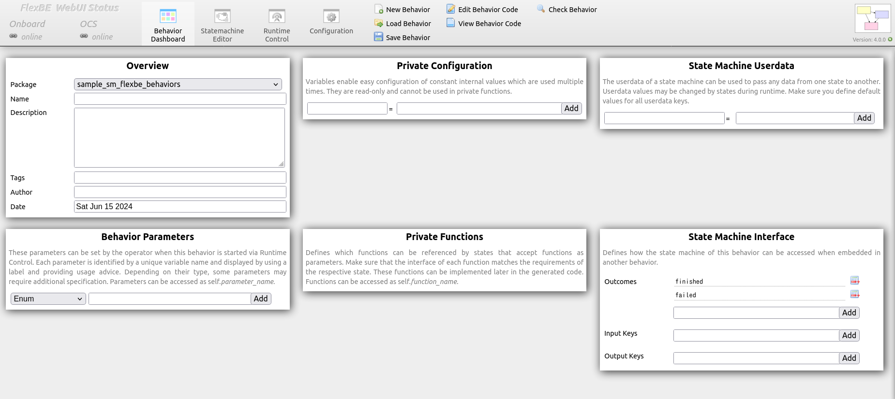
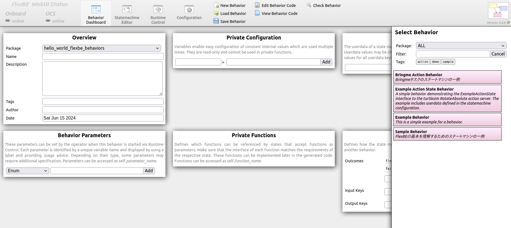
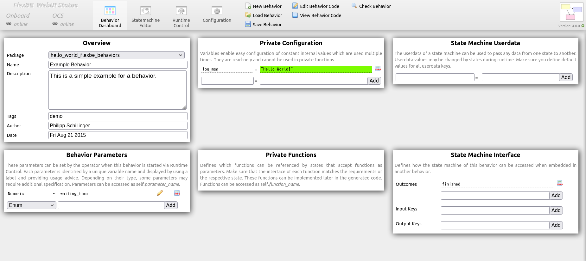
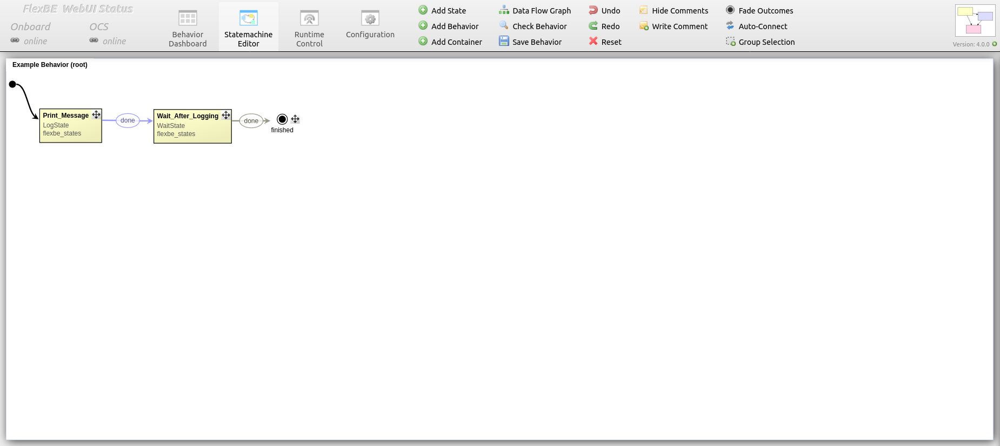
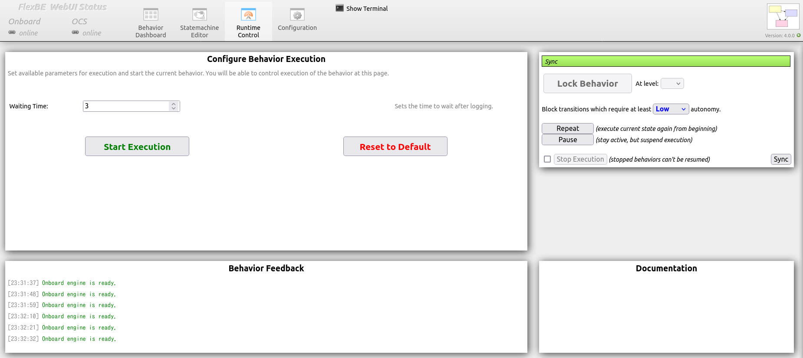
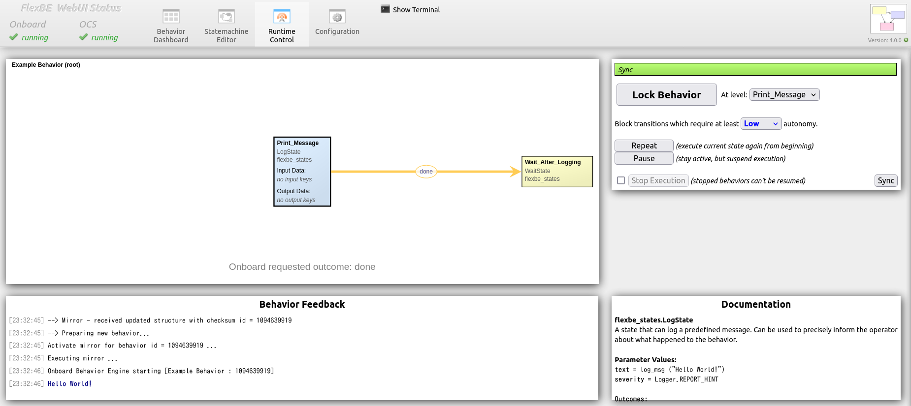
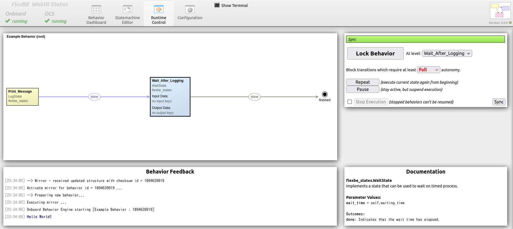

# 第7章 规划（修订第2版）

## 概要

《ROS 2与Python动手学AI机器人入门 修订第2版》（出村・萩原・升谷・坦 著，讲谈社）第7章的示例程序与补充信息等。

> [!IMPORTANT]
> 不再支持 `bringme_sm_smach`、`pseudo_node_service` 和 `sample_sm_smach` 这些仓库。
> 若需相关源代码的问题反馈，请在 [AI Robot Book 第7章 规划](https://github.com/AI-Robot-Book/chapter7) 仓库中提交 Issue。

## 安装方法

以下说明如何安装本仓库。

### 为 Smach 和 FlexBE 构建环境

1. 安装必要的 ROS 相关软件包：
  sudo apt-get update
  sudo apt-get install -y ros-humble-smach ros-humble-executive-smach

3. 首次使用 FlexBE 时，请下载 FlexBE Behavior Engine 与 FlexBE WebUI：
  cd ~/airobot_ws/src/
  git clone -b 4.0.0 https://github.com/FlexBE/flexbe_behavior_engine.git
  git clone https://github.com/AI-Robot-Book-Humble/flexbe_webui.git

4. 编译已下载的仓库：
  cd ~/airobot_ws/
  rosdep update
  rosdep install --from-paths src --ignore-src
  colcon build
  source install/setup.bash

5. 最后，安装 FlexBE WebUI 的 Python 依赖项：
  cd ~/airobot_ws/src/flexbe_webui/
  pip3 install -r requires.txt

### 本仓库的设置

1. 下载本仓库：
  cd ~/airobot_ws/src/
  git clone https://github.com/AI-Robot-Book-Humble/chapter7.git

> [!IMPORTANT]
> 本仓库使用了 [chapter2](https://github.com/AI-Robot-Book-Humble/chapter2) 中 [airobot_interfaces](https://github.com/AI-Robot-Book-Humble/chapter2/tree/master/airobot_interfaces) 定义的 Action 文件。
> 如果尚未安装该仓库，请一并克隆。

2. 编译下载的仓库：
  cd ~/airobot_ws/
  colcon build
  source install/setup.bash

## 状态机的创建方法

1. 设置工作空间路径：
  echo "export WORKSPACE_ROOT=~/airobot_ws" >> ~/.bashrc
  source ~/.bashrc

2. 进入工作空间的 `src` 目录：
  cd ~/airobot_ws/src/

3. 创建用于 Behaviors 的新包：
  ros2 run flexbe_widget create_repo hello_world

> [!NOTE]
> 可将 `hello_world` 替换为您想要的包名。

4. 当提示是否初始化 Git 仓库时，请回答 "**no**"：
  Initializing new behaviors repo hello_world_behaviors ...

  (2/5) Fetching project structure...
  Cloning into 'hello_world_behaviors'...
  remote: Enumerating objects: 156, done.
  remote: Counting objects: 100% (156/156), done.
  remote: Compressing objects: 100% (84/84), done.
  remote: Total 156 (delta 62), reused 149 (delta 55), pack-reused 0
  Receiving objects: 100% (156/156), 32.57 KiB | 4.07 MiB/s, done.
  Resolving deltas: 100% (62/62), done.
  Set up for ROS 2 development ...
  Already on 'ros2-devel'
  Your branch is up to date with 'origin/ros2-devel'.

  (3/5) Configuring project template...
  mv: 'PROJECT_behaviorshello_world_behaviors' の後に宛先のファイルオペランドがありません
  詳しくは 'mv --help' を実行して下さい。

  (4/5) Removing the original git repository...
  (5/5) Do you want to initialize a new Git repository for this project? (yes/no) no

4. 编译新创建的包：
  cd ~/airobot_ws/
  colcon build
  source install/setup.bash

5. 启动 FlexBE WebUI：
  ros2 launch flexbe_webui flexbe_full.launch.py

> [!NOTE]
> 若 FlexBE WebUI 无法启动，可能是缺少依赖。请进入 `flexbe_webui` 目录并运行：
  pip3 install -r requires.txt

6. 将显示 `Behavior Dashboard`。

7. 点击 `Load Behavior`，右侧将列出可用的 Behavior。

8. 从中选择 `Example Behavior`。

9. 切换到 `Statemachine Editor` 查看状态机结构。

10. 切换到 `Runtime Control` 并执行状态机。
    首先设置名为 `Waiting Time` 的初始等待时间。

11. 点击 `Start Execution` 开始执行。

| Print 状态 | Wait 状态 |
| --- | --- |
|  |  |

> [!NOTE]
> 为使状态从 `Print` 进入 `Wait`，需将 `Autonomy` 从 `Low` 改为 `Full`。

12. 终端输出示例如下：
  [00:28:31] Onboard engine is ready.
  [00:28:35] --> Mirror - received updated structure with checksum id = 10094639919
  [00:28:35] Activate mirror for behavior id = 10094639919 ...
  [00:28:35] Executing mirror ...
  [00:28:35] --> Preparing new behavior...
  [00:28:35] Onboard Behavior Engine starting [Example Behavior : 10094639919]
  [00:28:35] Hello World!
  [00:28:39] PreemptableStateMachine 'Example Behavior' spin() - done with outcome=finished
  [00:28:39] No behavior active.
  [00:28:39] [92m--- Behavior Mirror ready! ---[00m
  [00:28:39] Onboard engine is ready.

## 目录结构

- **[sample_sm_flexbe](sample_sm_flexbe):** 双状态状态机示例程序（FlexBE 版）
- **[bringme_sm_flexbe](bringme_sm_flexbe):** “Bring me” 任务的状态机示例程序（FlexBE 版）
- **[pseudo_node_action](pseudo_node_action):** “Bring me” 任务中语音、导航、视觉、操作的伪节点示例（基于 Action）
- **[(归档) sample_sm_smach](sample_sm_smach):** 双状态状态机示例程序（Smach 版）
- **[(归档) bringme_sm_smach](bringme_sm_smach):** “Bring me” 任务的状态机示例程序（Smach 版）
- **[(归档) pseudo_node_service](pseudo_node_service):** “Bring me” 任务中语音、导航、视觉、操作的伪节点示例（基于 Service）