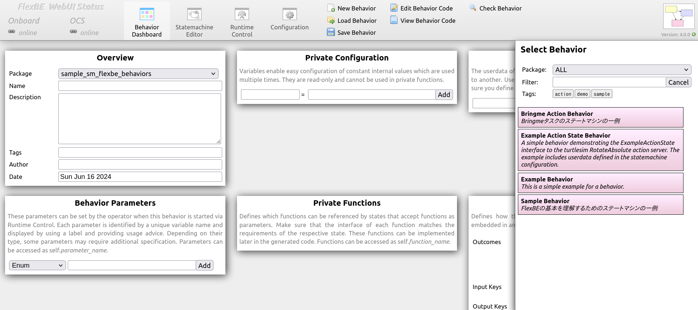
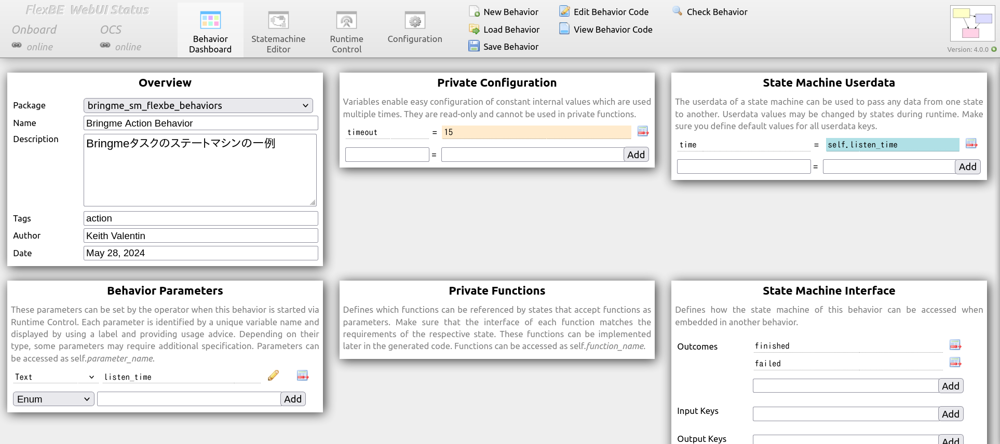
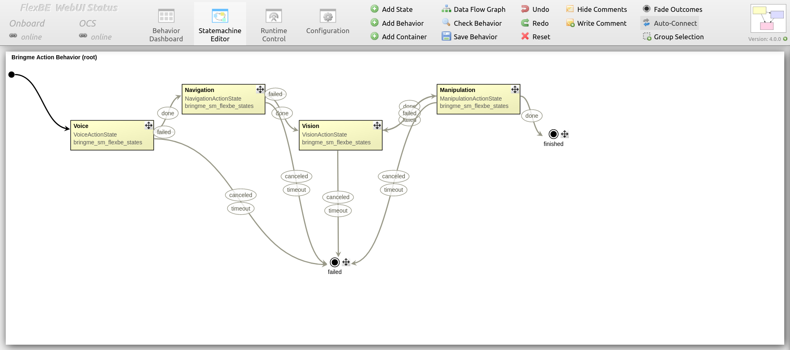
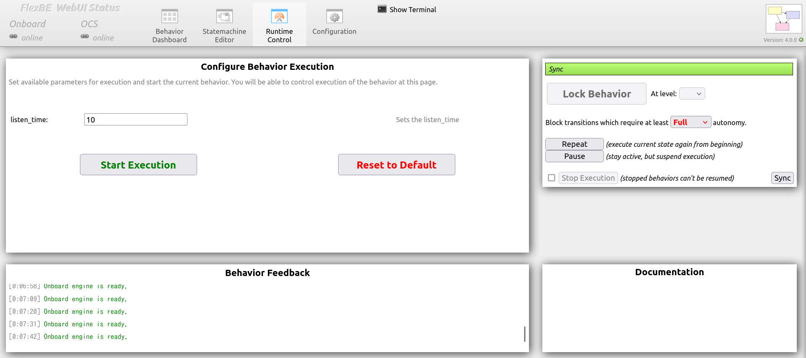
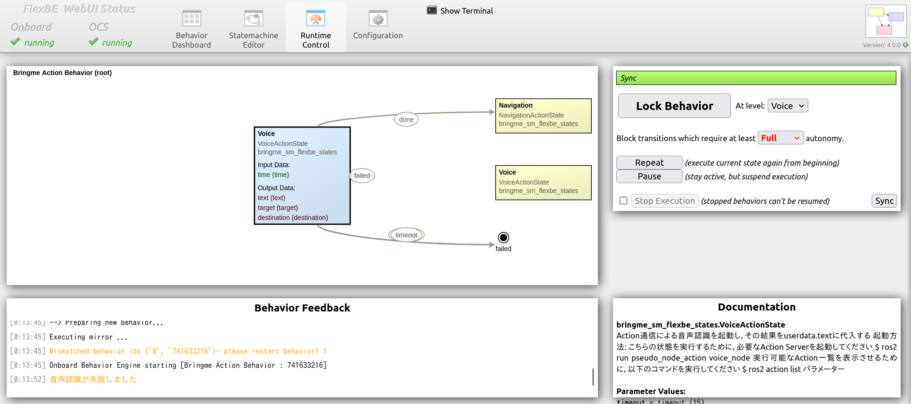
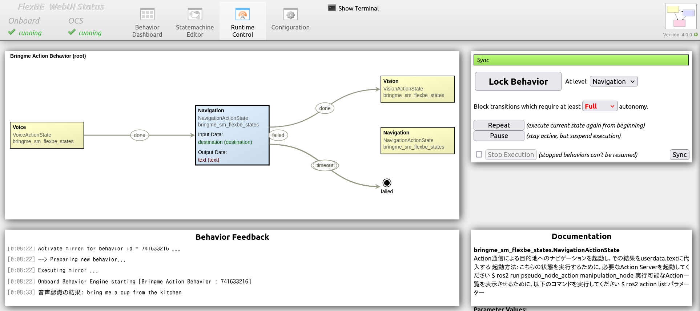
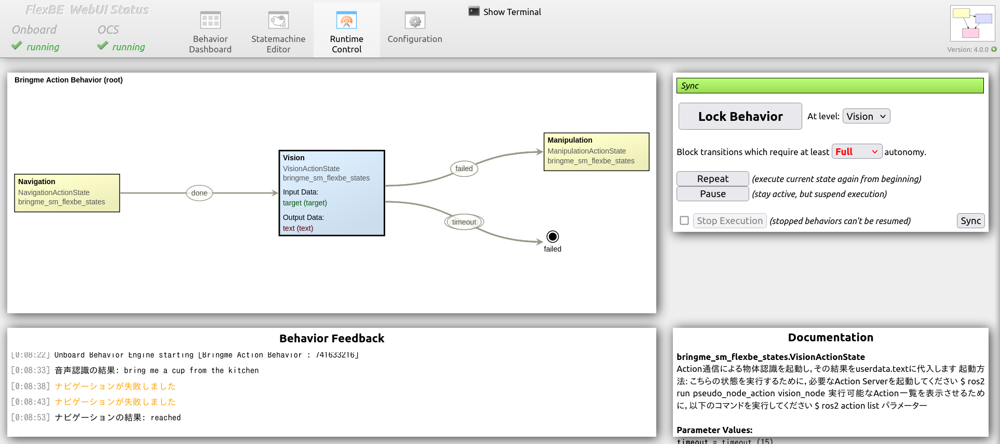
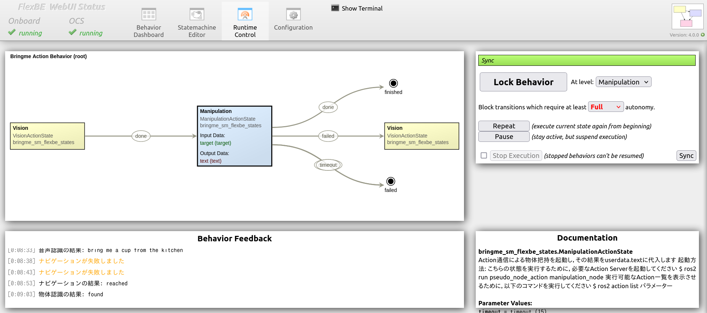

# bringme_sm_flexbe

第7.4节的示例程序  
用于“Bring me”任务的 FlexBE 状态机程序

## 运行

1. 启动“Bring me”任务所需的 Action Server，运行以下 launch 文件：
  ros2 launch pseudo_node_action bringme.launch.py

2. 启动 FlexBE WebUI：
  ros2 launch flexbe_webui flexbe_full.launch.py

> [!NOTE]
> 若 FlexBE WebUI 无法启动，可能是缺少依赖包。
> 此时请进入 `flexbe_webui` 目录并执行：
  pip3 install -r requires.txt

3. 将显示 `Behavior Dashboard`。

4. 点击 `Load Behavior`，右侧将列出可用的 Behavior。

5. 从中选择 `Bringme Action Behavior`。

6. 切换到 `Statemachine Editor` 查看状态机结构。

7. 切换到 `Runtime Control` 并执行状态机。
   首先设置参数 `listen_time`。

> [!NOTE]
> `listen_time` 表示语音识别的启动持续时间，可自由调整该值。

8. 点击 `Start Execution` 开始执行。

| 语音状态 | 导航状态 |
| --- | --- |
|  |  |

| 视觉状态 | 操作状态 |
| --- | --- |
|  |  |

9. 终端输出示例如下：
  [00:37:59] Onboard engine is ready.
  [00:38:00] --> Mirror - received updated structure with checksum id = 741633216
  [00:38:00] Activate mirror for behavior id = 741633216 ...
  [00:38:00] --> Preparing new behavior...
  [00:38:00] Executing mirror ...
  [00:38:00] Onboard Behavior Engine starting [Bringme Action Behavior : 741633216]
  [00:38:11] 音声認識の結果: bring me a cup from the kitchen
  [00:38:15] ナビゲーションが失敗しました
  [00:38:18] ナビゲーションが失敗しました
  [00:38:28] ナビゲーションの結果: reached
  [00:38:38] 物体認識の結果: found
  [00:38:39] 物体把持が失敗しました
  [00:38:49] 物体認識の結果: found
  [00:38:59] 物体把持の結果: reached
  [00:38:59] PreemptableStateMachine 'Bringme Action Behavior' spin() - done with outcome=finished
  [00:39:00] No behavior active.
  [00:39:00] Onboard engine is ready.
  [00:39:00] [92m--- Behavior Mirror ready! ---[00m
  [00:39:10] Onboard engine is ready.

## States 列表

* [voice_action_state.py](bringme_sm_flexbe_states/bringme_sm_flexbe_states/voice_action_state.py):
  * 实现语音识别状态

* [navigation_action_state.py](bringme_sm_flexbe_states/bringme_sm_flexbe_states/navigation_action_state.py):
  * 实现导航状态

* [vision_action_state.py](bringme_sm_flexbe_states/bringme_sm_flexbe_states/vision_action_state.py):
  * 实现物体识别状态

* [manipulation_action_state.py](bringme_sm_flexbe_states/bringme_sm_flexbe_states/manipulation_action_state.py):
  * 实现物体抓取状态

## Behaviors 列表

* [bringme_action_behavior_sm.py](bringme_sm_flexbe_behaviors/bringme_sm_flexbe_behaviors/bringme_action_behavior_sm.py):
  * 包含语音识别、导航、物体识别与抓取的完整“Bring me”任务状态机

## 帮助

## 作者

萩原 良信

## 历史

## 许可证

Copyright (c) 2025, HAGIWARA Yoshinobu, VALENTIN CARDENAS Keith and OKUMA Yuki.  
All rights reserved.  
This project is licensed under the Apache License 2.0 license found in the LICENSE file in the root directory of this project.

## 参考文献