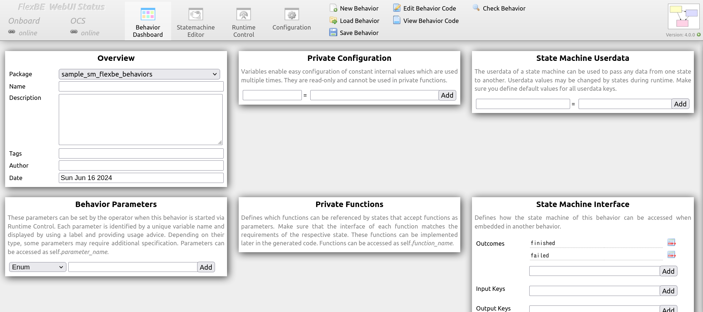
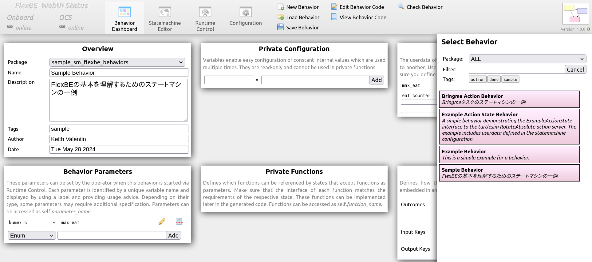
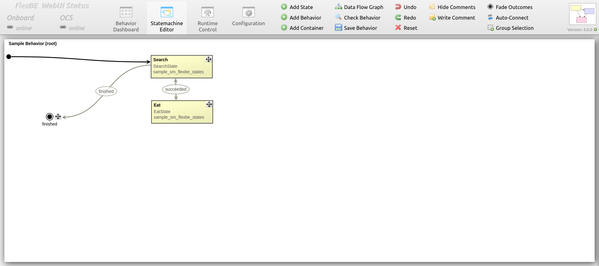
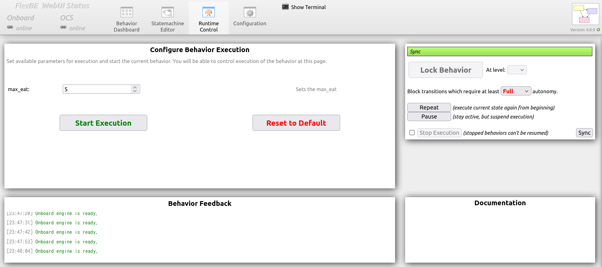
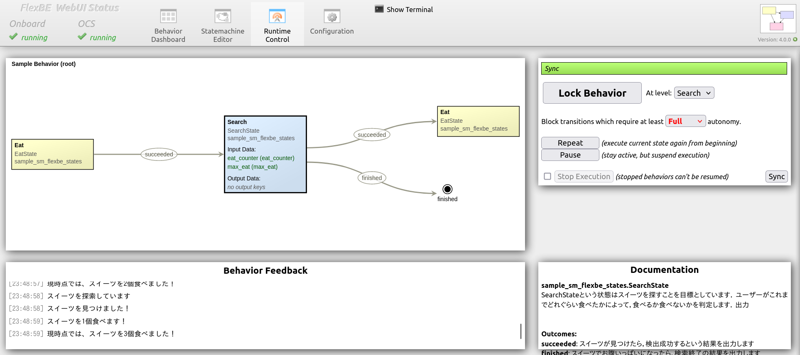
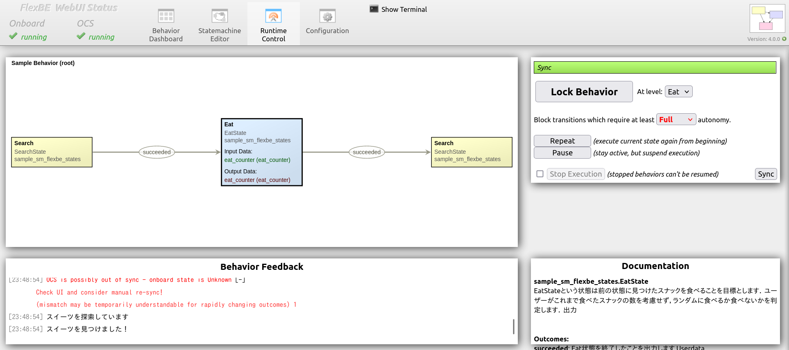

# sample_sm_flexbe

第7.3节的示例程序  
基于 FlexBE 的双状态状态机程序

## 运行

1. 启动 FlexBE WebUI：
  ros2 launch flexbe_webui flexbe_full.launch.py

> [!NOTE]
> 若 FlexBE WebUI 无法启动，可能是缺少依赖。
> 此时请进入 `flexbe_webui` 目录并执行：
  pip3 install -r requires.txt

2. 将显示 `Behavior Dashboard`。

3. 点击 `Load Behavior`，右侧将列出可用的 Behavior。

4. 从中选择 `Sample Behavior`。

5. 切换到 `Statemachine Editor` 查看状态机结构。

6. 切换到 `Runtime Control` 并执行状态机。
   首先设置参数 `max_eat`。

> [!NOTE]
> `max_eat` 表示用户最多能吃的甜点数量，可自由调整该值。

7. 点击 `Start Execution` 开始执行。

| 搜索状态 | 进食状态 |
| --- | --- |
|  |  |

8. 终端输出示例如下：
  [00:50:45] Onboard engine is ready.
  [00:50:50] --> Mirror - received updated structure with checksum id = 551566305
  [00:50:50] Activate mirror for behavior id = 551566305 ...
  [00:50:50] --> Preparing new behavior...
  [00:50:50] Executing mirror ...
  [00:50:50] Onboard Behavior Engine starting [Sample Behavior : 551566305]
  [00:50:52] 正在搜索甜点
  [00:50:52] 找到甜点了！
  [00:50:53] 吃掉1个甜点！
  [00:50:53] 目前已吃掉1个甜点！
  [00:50:54] 正在搜索甜点
  [00:50:54] 找到甜点了！
  [00:50:55] 吃掉1个甜点！
  [00:50:55] 目前已吃掉2个甜点！
  [00:50:56] 正在搜索甜点
  [00:50:56] 找到甜点了！
  [00:50:57] 吃掉1个甜点！
  [00:50:57] 目前已吃掉3个甜点！
  [00:50:58] 正在搜索甜点
  [00:50:58] 找到甜点了！
  [00:50:59] 吃掉1个甜点！
  [00:50:59] 目前已吃掉4个甜点！
  [00:51:00] 正在搜索甜点
  [00:51:00] 找到甜点了！
  [00:51:01] 吃掉1个甜点！
  [00:51:01] 目前已吃掉5个甜点！
  [00:51:02] 正在搜索甜点
  [00:51:02] 已经吃饱了……
  [00:51:02] PreemptableStateMachine 'Sample Behavior' spin() - done with outcome=finished
  [00:51:02] No behavior active.
  [00:51:02] [92m--- Behavior Mirror ready! ---[00m

## States 列表

* [search_state.py](sample_sm_flexbe_states/sample_sm_flexbe_states/search_state.py):
  * 实现搜索零食的状态

* [eat_state.py](sample_sm_flexbe_states/sample_sm_flexbe_states/eat_state.py):
  * 实现吃掉找到的零食的状态

* [grasp_state.py](sample_sm_flexbe_states/sample_sm_flexbe_states/grasp_state.py):
  * 实现抓取找到的零食的状态（进阶版本）

## Behaviors 列表

* [sample_behavior_sm.py](sample_sm_flexbe_behaviors/sample_sm_flexbe_behaviors/sample_behavior_sm.py):
  * 包含搜索与进食状态的示例任务状态机

## 帮助

## 作者

萩原 良信

## 历史

## 许可证

Copyright (c) 2025, HAGIWARA Yoshinobu, VALENTIN CARDENAS Keith and OKUMA Yuki.  
All rights reserved.  
This project is licensed under the Apache License 2.0 license found in the LICENSE file in the root directory of this project.

## 参考文献